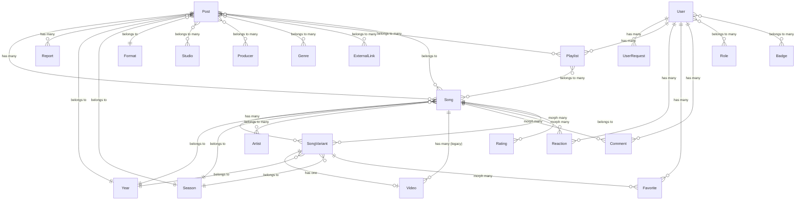

# Database Documentation

This document describes the database schema, migrations, and model relationships for the Anirank project.

## Entity-Relationship Overview

---

## Core Content

### `posts` (Anime)

Represents an anime entry.

- **Columns**: `id`, `title`, `slug`, `description`, `anilist_id`, `status`, `thumbnail`, `banner`, `year_id`, `season_id`, `format_id`, `timestamps`.
- **Relationships**:
    - `songs()`: HasMany `Song`.
    - `year()`, `season()`, `format()`: BelongsTo metadata models.
    - `studios()`, `producers()`, `genres()`, `externalLinks()`: BelongsToMany (via pivot).

### `songs` (Themes)

Represents a specific theme (Opening/Ending) associated with a post.

- **Columns**: `id`, `song_romaji`, `song_jp`, `song_en`, `theme_num`, `type` (OP, ED, INS, OTH), `slug`, `post_id`, `season_id`, `year_id`, `views`, `timestamps`.
- **Relationships**:
    - `post()`: BelongsTo `Post`.
    - `songVariants()`: HasMany `SongVariant`.
    - `artists()`: BelongsToMany `Artist` (via `artist_song`).
    - `year()`, `season()`: BelongsTo metadata models.
    - `ratings()`, `comments()`, `reactions()`: Polymorphic relations via `Rateable` trait or MorphMany.

### `song_variants`

Different versions of the same song (e.g., V1, V2).

- **Columns**: `id`, `version_number`, `song_id`, `views`, `slug`, `season_id`, `year_id`, `spoiler`, `timestamps`.
- **Relationships**:
    - `song()`: BelongsTo `Song`.
    - `video()`: HasOne `Video`.
    - `favorites()`: MorphMany `Favorite`.

### `videos`

The actual video content (embed or local file) for a song variant.

- **Columns**: `id`, `embed_code`, `video_src`, `type` (embed, file), `song_variant_id`, `timestamps`.
- **Relationships**:
    - `songVariant()`: BelongsTo `SongVariant`.

### `artists`

- **Columns**: `id`, `name`, `name_jp`, `slug`, `timestamps`.
- **Relationships**:
    - `songs()`: BelongsToMany `Song` (via `artist_song`).

---

## User Interactions

### `ratings`

Polymorphic ratings managed by the `Rateable` trait.

- **Columns**: `id`, `user_id`, `rating`, `rateable_id`, `rateable_type`, `timestamps`.

### `reactions`

Likes and dislikes.

- **Columns**: `id`, `user_id`, `reactable_id`, `reactable_type`, `type` (1 for Like, -1 for Dislike), `timestamps`.

### `favorites`

- **Columns**: `id`, `user_id`, `favoritable_id`, `favoritable_type`, `timestamps`.

### `comments`

- **Columns**: `id`, `user_id`, `commentable_id`, `commentable_type`, `content`, `timestamps`.

### `playlists`

- **Columns**: `id`, `name`, `description`, `user_id`, `is_public`, `timestamps`.
- **Relationships**:
    - `user()`: BelongsTo `User`.
    - `songs()`: BelongsToMany `Song` (via `playlist_post` with `position`).

---

## Metadata & Access Control

### `users`

- **Columns**: `id`, `name`, `slug`, `email`, `email_verified_at`, `password`, `score_format`, `image`, `banner`, `last_login_at`, `timestamps`.
- **Relationships**:
    - `roles()`: BelongsToMany `Role`.
    - `badges()`: BelongsToMany `Badge` (via `badge_user` with `awarded_at`).
    - `playlists()`, `favorites()`, `reactions()`, `comments()`: HasMany.

### `roles` & `badges`

- **Roles**: `admin`, `editor`, `creator`, `user`.
- **Badges**: Awarded to users based on achievements.

---

## Pivot Tables

- `artist_song`: `artist_id`, `song_id`.
- `post_studio`: `post_id`, `studio_id`.
- `post_producer`: `post_id`, `producer_id`.
- `genre_post`: `genre_id`, `post_id`.
- `playlist_post`: `playlist_id`, `song_id`, `position`.
- `badge_user`: `badge_id`, `user_id`, `awarded_at`.
- `post_external_link`: `post_id`, `external_link_id`.
